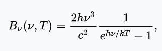
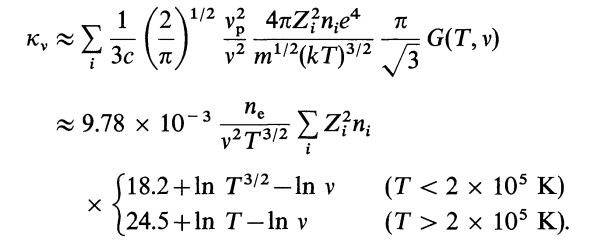
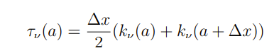
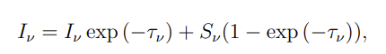
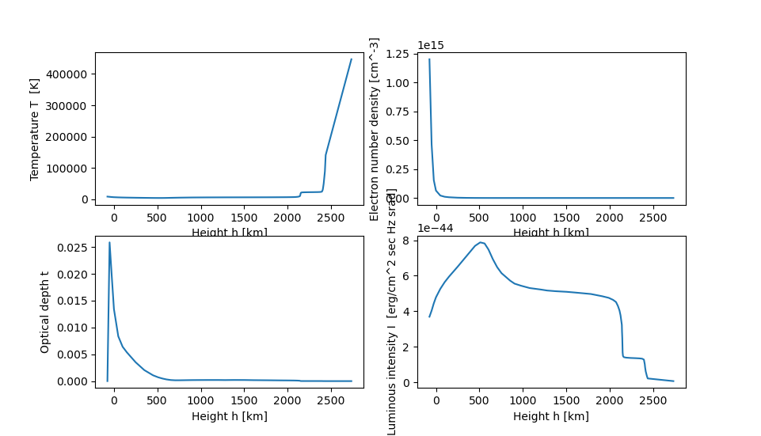

# -dynamic_systems_2022_Luminous_intensity
## Definition
Exercise for the evaluaci.

### Writed by: Gustavo Alfredo Zárate Acosta (GustavoZA20@hotmail.com)
Information Technology in Sciences student at ENES Morelia, UNAM.

## Introduction
Evaluation exercise of a dynamic system of Luminous intensity and Optical depth.

## Methodology






## Requiriments
This proyect use Python v. 3.8,
### Libraries
1. Numpy
     - ```pip3 install numpy==1.61.2```
2. Matplotlib
     - ```pip3 install matplotlib==3.0.2```
3. Scipy
     - ```pip3 install scipy==1.6.2```
4. Pandas
     - ```pip3 install matplotlib==1.2.4```


## Run
  Create an image called 'examen_SD.png' and display it in an interactive window
  ```bash
   $ python examen_SD.py
  ```
### Results


## References
- [Matplotlib](https://matplotlib.org/2.1.2/) Documentation.
- [Dynamic System 2022 course](https://github.com/giccunam/dynamicsystems2022)as.
- [Scipy Constants] (https://pythonguides.com/scipy-constants/)
- [Radiacion de cuerpo negro] (https://es.wikipedia.org/wiki/Radiaci%C3%B3n_de_cuerpo_negro#La_ley_de_Planck_de_la_radiaci%C3%B3n_del_cuerpo_negro)
- [Constante_de_Planck] (https://es.wikipedia.org/wiki/Constante_de_Planck)
- [Plasma oscillation] (https://en.wikipedia.org/wiki/Plasma_oscillation)
- [Profundidad optica] (https://es.wikipedia.org/wiki/Profundidad_%C3%B3ptica)
